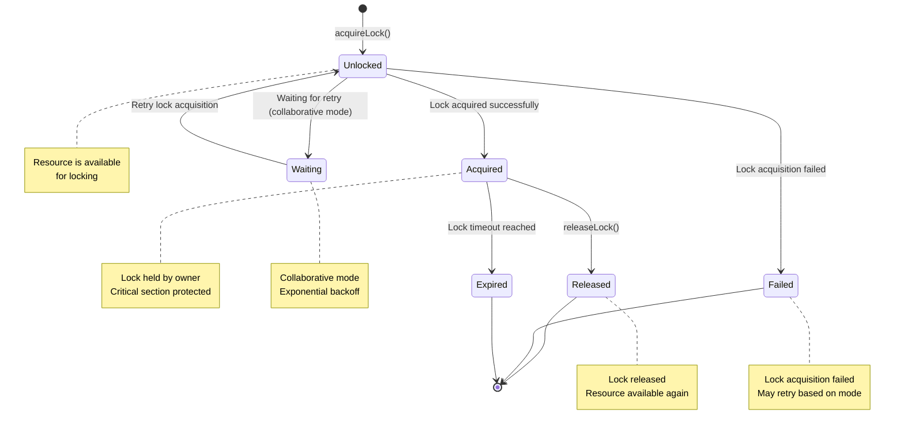

# Lock Manager State Machine

## States



## Acquire Lock Flow

```
┌─────────────────────┐
│  Acquire Lock      │
│  Request          │
└─────────┬───────────┘
          │
          ▼
    ┌──────────────────┬──────────────────┬─────────────┐
    │                  │                  │             │
    ▼                  ▼                  ▼             ▼
  Exclusive         Collaborative      Timeout        Resource
  (single agent)    (multiple agents)    check          not found
    │                  │                  │             │
    ▼                  ▼                  ▼             ▼
Acquire Lock        Acquire Lock         Wait or       Fail
                    (with retry)        fail
    │                  │                  │             │
    ▼                  ▼                  └─────────────┴────────┐
    │                                                          │
    ▼                                                          ▼
  Success                                                 Retry/Limit
    │                                                        Reached
    ▼                                                          │
 Return LockInfo                                          Return Error
    └──────────────────────────────────────────────────────────────────┘
```

## Release Lock Flow

```
┌─────────────────────┐
│  Release Lock      │
│  Request          │
└─────────┬───────────┘
          │
          ▼
    ┌──────────────────┬──────────────────┐
    │                  │                  │
    ▼                  ▼                  ▼
  Lock Found        Release Success     Lock Not Found
    │                  │                  │
    ▼                  ▼                  ▼
Delete Version      Return Success    Log Warning
    (increment)         (unlock)       (but no action)
    │                  │                  │
    ▼                  └──────────────────┴────────┐
    │                                     │
    ▼                                     ▼
 Success                               Return Success
    (removed)                             (no-op)
    └─────────────────────────────────────────┘
```

## Lock Modes

### Exclusive Mode

**Use Case**: Single agent working on a task

**Behavior**:
- Only one lock holder at a time
- Immediate failure on conflict
- No retry on conflict

```typescript
await lockManager.acquireLockWithRetry(
  'task:123',
  'agent-1',
  'exclusive',  // Mode
  1,            // maxRetries
  30000          // timeout
);
```

### Collaborative Mode

**Use Case**: Multiple agents working on different parts of a task

**Behavior**:
- Multiple lock holders allowed
- Optimistic versioning for conflict detection
- Automatic retry with exponential backoff
- Last writer wins

```typescript
await lockManager.acquireLockWithRetry(
  'task:123',
  'agent-1',
  'collaborative', // Mode
  10,              // maxRetries
  60000            // timeout
);
```

## Lock Info Structure

```typescript
interface LockInfo {
  resource: string;    // Resource identifier
  owner: string;      // Lock owner
  acquiredAt: Date;   // When lock was acquired
  timeout?: number;    // Lock timeout in ms
  version: number;    // Optimistic version number
}
```

## Statistics

```typescript
{
  totalLocks: number;           // Total locks in system
  activeLocks: number;          // Currently held locks
  expiredLocks: number;         // Locks past timeout
  conflictsDetected: number;     // Number of conflicts
  averageHoldTime: number;       // Avg time locks held
}
```

## Error Codes

| Code | Description | Recovery |
|------|-------------|----------|
| `LOCK_ACQUISION_FAILED` | Failed to acquire lock | Retry (collaborative) or fail (exclusive) |
| `LOCK_NOT_HELD` | Trying to release lock not owned by caller | Verify lock owner |
| `LOCK_TIMEOUT` | Lock expired before release | Re-acquire and retry |
| `RESOURCE_LOCKED` | Resource already locked | Wait or use collaborative mode |

## Performance Metrics

- **Lock Acquisition**: <1ms (fast path)
- **Lock Release**: <0.5ms
- **Conflict Detection**: <5ms
- **Throughput**: 742K ops/sec
- **Backoff Delays**: 100ms, 200ms, 400ms, 800ms, 1000ms

---

**Last Updated**: 2026-01-31
**Version**: 0.1.0-alpha
