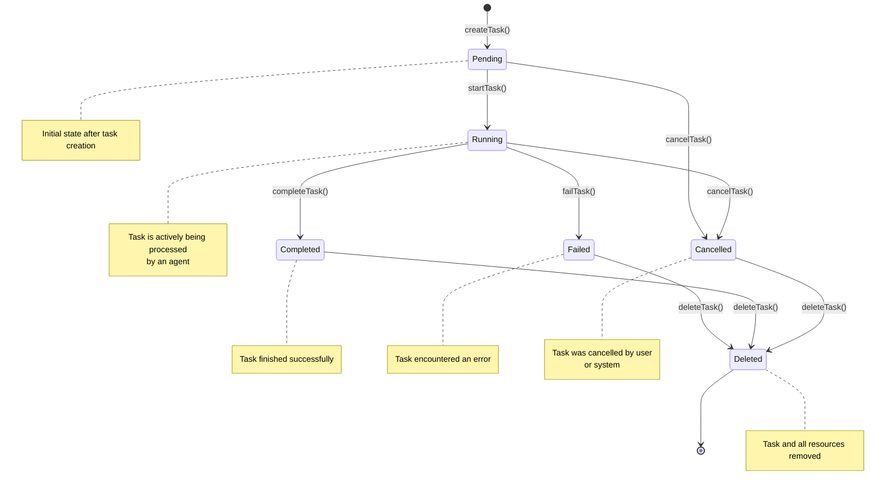

# Task Lifecycle State Machine

## States



## State Transitions

| From State | To State | Trigger | Method |
|------------|----------|---------|---------|
| **N/A** | Pending | Task created | `taskLifecycle.createTask()` |
| Pending | Running | Agent attaches | `taskLifecycle.startTask()` |
| Running | Completed | Task finishes successfully | `taskLifecycle.completeTask()` |
| Running | Failed | Task encounters error | `taskLifecycle.failTask()` |
| Pending | Cancelled | User or system cancels | `taskLifecycle.cancelTask()` |
| Running | Cancelled | User or system cancels | `taskLifecycle.cancelTask()` |
| Failed | Deleted | Cleanup | `taskLifecycle.deleteTask()` |
| Completed | Deleted | Cleanup | `taskLifecycle.deleteTask()` |
| Cancelled | Deleted | Cleanup | `taskLifecycle.deleteTask()` |

## Hook Execution Points

### Task Start Flow
```
1. beforeTaskStart hooks execute (priority order)
   ↓
2. Acquire lock (task:{taskId})
   ↓
3. Validate state (must be 'pending')
   ↓
4. Update registry (status → 'running')
   ↓
5. Log transition (info level)
   ↓
6. Release lock
   ↓
7. afterTaskStart hooks execute (priority order)
```

### Task Complete Flow
```
1. beforeTaskComplete hooks execute (priority order)
   ↓
2. Acquire lock (task:{taskId})
   ↓
3. Validate state (must be 'running')
   ↓
4. Update registry (status → 'completed')
   ↓
5. Log completion (info level)
   ↓
6. Release lock
   ↓
7. afterTaskComplete hooks execute (priority order)
```

### Task Fail Flow
```
1. beforeTaskFail hooks execute (priority order)
   ↓
2. Acquire lock (task:{taskId})
   ↓
3. Validate state (must be 'running')
   ↓
4. Update registry (status → 'failed')
   ↓
5. Log error (error level)
   ↓
6. Store error in metadata
   ↓
7. Release lock
   ↓
8. afterTaskFail hooks execute (priority order)
```

## Lock Manager Integration

Each state transition is wrapped in a lock:

```typescript
lockManager.withLock(
  `task:${taskId}`,      // Resource
  `lifecycle:${owner}`,   // Lock owner
  async () => {
    // Critical section
    // - Registry operations
    // - Persistence operations
    // - State validation
  },
  'exclusive'              // Lock mode
);
```

## Error Handling

### State Validation Errors

| Error | Condition | Handling |
|--------|-----------|-----------|
| Task not found | Task ID doesn't exist | Throw error |
| Invalid transition | `startTask()` on non-'pending' task | Throw error |
| Invalid transition | `completeTask()` on non-'running' task | Throw error |
| Invalid transition | `failTask()` on non-'running' task | Throw error |
| Invalid transition | `cancelTask()` on non-'pending'/'running' task | Throw error |

### Hook Error Handling

- **Continue on error**: Hooks log errors but don't block flow
- **Error isolation**: Hook errors don't affect other hooks
- **Logging**: All hook errors logged with duration

## Concurrency Modes

### Exclusive Mode (Single Agent)

```
Lock Resource: task:{taskId}
Lock Owner: agent-id
Lock Mode: exclusive
Behavior:  - Only one agent can lock resource
           - Other agents wait or fail
           - No concurrent modifications
```

### Collaborative Mode (Multiple Agents)

```
Lock Resource: task:{taskId}
Lock Owner: agent-id (first)
Lock Mode: collaborative
Behavior:  - Multiple agents can lock resource
           - Conflicts detected via version numbers
           - Last writer wins (optimistic locking)
           - Agents must implement conflict resolution
```

---

**Last Updated**: 2026-01-31
**Version**: 0.1.0-alpha
