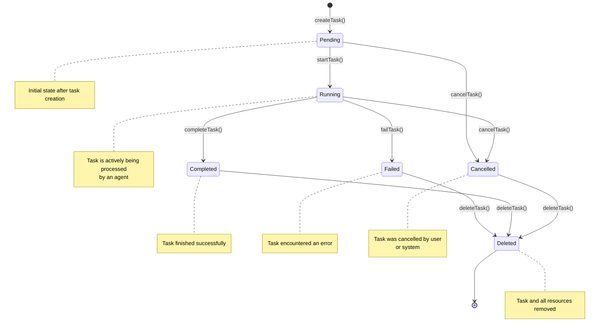
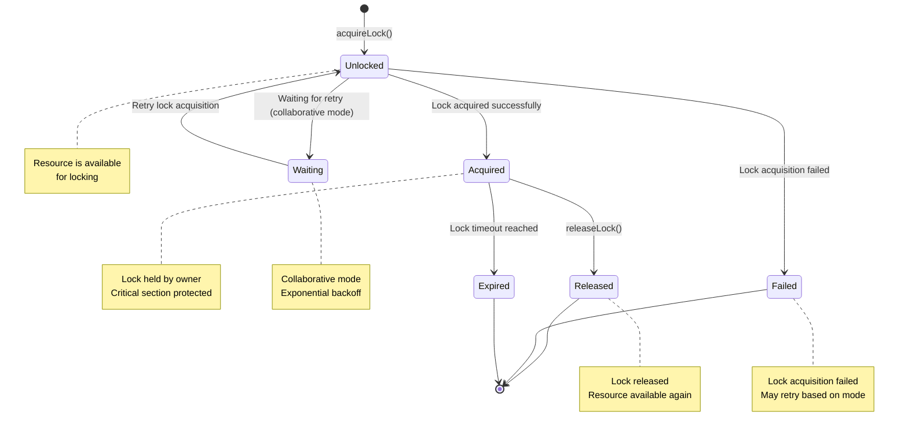

# State Machine Diagrams

Complete state machine diagrams for all major OpenCode Tools systems.

## Available Diagrams

1. **[Task Lifecycle](#task-lifecycle)** - Complete task state transitions
   - All states: pending, running, completed, failed, cancelled, deleted
   - Hook execution points
   - Lock manager integration
   - Error handling flows

2. **[Lock Manager](#lock-manager)** - Concurrency control system
   - Exclusive and collaborative modes
   - Lock acquisition/release flows
   - Retry mechanisms with backoff
   - Performance metrics

3. **[Multi-Layer Persistence](#multi-layer-persistence)** - 4-layer storage architecture
   - Layer 1: State (state.json)
   - Layer 2: Logs (logs.jsonl)
   - Layer 3: Decisions (decisions.md)
   - Layer 4: Checkpoints (checkpoints/\*\*)
   - Filesystem structure
   - Performance characteristics

## Viewing Diagrams

All diagrams use Mermaid syntax and can be rendered in:

- **GitHub**: Automatically renders Mermaid in markdown files
- **GitLab**: Supports Mermaid in markdown
- **VS Code**: Install Mermaid preview extension
- **Online**: [Mermaid Live Editor](https://mermaid.live/)

## State Notation

| Symbol | Meaning                 |
| ------ | ----------------------- |
| `[*]`  | Initial/final state     |
| `→`    | Transition on success   |
| `--→`  | Transition on condition |
| `⭕`   | Decision point          |
| `⊕`    | Parallel operations     |
| `Ⓜ`   | Fork/merge point        |
| `⏭`   | Termination point       |

## State Machine Conventions

1. **State Names**: PascalCase (e.g., Pending, Running)
2. **Transition Labels**: Method names (e.g., startTask(), completeTask())
3. **Triggers**: Event names (e.g., agent_attached, task_completed)
4. **Guards**: Preconditions (e.g., status == 'pending')
5. **Actions**: Side effects (e.g., log_event, update_database)

---

## Task Lifecycle

### States



### State Transitions

| From State | To State  | Trigger                    | Method                         |
| ---------- | --------- | -------------------------- | ------------------------------ |
| **N/A**    | Pending   | Task created               | `taskLifecycle.createTask()`   |
| Pending    | Running   | Agent attaches             | `taskLifecycle.startTask()`    |
| Running    | Completed | Task finishes successfully | `taskLifecycle.completeTask()` |
| Running    | Failed    | Task encounters error      | `taskLifecycle.failTask()`     |
| Pending    | Cancelled | User or system cancels     | `taskLifecycle.cancelTask()`   |
| Running    | Cancelled | User or system cancels     | `taskLifecycle.cancelTask()`   |
| Failed     | Deleted   | Cleanup                    | `taskLifecycle.deleteTask()`   |
| Completed  | Deleted   | Cleanup                    | `taskLifecycle.deleteTask()`   |
| Cancelled  | Deleted   | Cleanup                    | `taskLifecycle.deleteTask()`   |

### Hook Execution Points

#### Task Start Flow

```
1. beforeTaskStart hooks execute (priority order)
   ↓
2. Acquire lock (task:{taskId})
   ↓
3. Validate state (must be 'pending')
   ↓
4. Update registry (status → 'running')
   ↓
5. Log transition (info level)
   ↓
6. Release lock
   ↓
7. afterTaskStart hooks execute (priority order)
```

#### Task Complete Flow

```
1. beforeTaskComplete hooks execute (priority order)
   ↓
2. Acquire lock (task:{taskId})
   ↓
3. Validate state (must be 'running')
   ↓
4. Update registry (status → 'completed')
   ↓
5. Log completion (info level)
   ↓
6. Release lock
   ↓
7. afterTaskComplete hooks execute (priority order)
```

#### Task Fail Flow

```
1. beforeTaskFail hooks execute (priority order)
   ↓
2. Acquire lock (task:{taskId})
   ↓
3. Validate state (must be 'running')
   ↓
4. Update registry (status → 'failed')
   ↓
5. Log error (error level)
   ↓
6. Store error in metadata
   ↓
7. Release lock
   ↓
8. afterTaskFail hooks execute (priority order)
```

---

## Lock Manager

### States



### Acquire Lock Flow

```
┌─────────────────────┐
│  Acquire Lock       │
│  Request            │
└─────────┬───────────┘
          │
          ▼
    ┌──────────────────┬──────────────────┬─────────────┐
    │                  │                  │             │
    ▼                  ▼                  ▼             ▼
  Exclusive         Collaborative      Timeout        Resource
  (single agent)    (multiple agents)    check          not found
    │                  │                  │             │
    ▼                  ▼                  ▼             ▼
Acquire Lock        Acquire Lock         Wait or       Fail
                   (with retry)        fail
    │                  │                  │             │
    ▼                  ▼                  └─────────────┴──────┐
    │                                                          │
    ▼                                                          ▼
  Success                                                 Retry/Limit
    │                                                        Reached
    ▼                                                          │
 Return LockInfo                                          Return Error
    └──────────────────────────────────────────────────────────────────┘
```

### Release Lock Flow

```
┌─────────────────────┐
│  Release Lock       │
│  Request            │
└─────────┬───────────┘
          │
          ▼
    ┌──────────────────┬──────────────────┐
    │                  │                  │
    ▼                  ▼                  ▼
  Lock Found        Release Success     Lock Not Found
    │                  │                  │
    ▼                  ▼                  ▼
Delete Version      Return Success    Log Warning
    (increment)         (unlock)       (but no action)
    │                  │                  │
    ▼                  └──────────────────┴────────┐
    │                                     │
    ▼                                     ▼
 Success                               Return Success
    (removed)                             (no-op)
    └─────────────────────────────────────────┘
```

### Lock Modes

#### Exclusive Mode

**Use Case**: Single agent working on a task

**Behavior**:

- Only one lock holder at a time
- Immediate failure on conflict
- No retry on conflict

```typescript
await lockManager.acquireLockWithRetry(
  "task:123",
  "agent-1",
  "exclusive", // Mode
  1, // maxRetries
  30000, // timeout
);
```

#### Collaborative Mode

**Use Case**: Multiple agents working on different parts of a task

**Behavior**:

- Multiple lock holders allowed
- Optimistic versioning for conflict detection
- Automatic retry with exponential backoff
- Last writer wins

```typescript
await lockManager.acquireLockWithRetry(
  "task:123",
  "agent-1",
  "collaborative", // Mode
  10, // maxRetries
  60000, // timeout
);
```

---

## Multi-Layer Persistence

### Layer 1: State (state.json)

#### Operations

```
┌─────────────────────────────────────────┐
│         saveState()                     │
│  ┌────────────────────────┐             │
│  │ 1. Generate Checksum   │             │
│  │ 2. Write to .tmp       │             │
│  │ 3. Atomic Rename       │             │
│  └────────────────────────┘             │
└─────────┬───────────────────────────────┘
          │
          ▼
┌─────────────────────────────────────────┐
│         loadState()                     │
│  ┌────────────────────────┐             │
│  │ 1. Read File           │             │
│  │ 2. Validate Checksum   │             │
│  │ 3. Return State        │             │
│  └────────────────────────┘             │
└─────────────────────────────────────────┘
```

#### State Structure

```json
{
  "taskId": "task_123",
  "status": "running",
  "data": {
    "progress": 50,
    "custom": "metadata"
  },
  "lastUpdated": "2026-01-31T12:00:00.000Z",
  "checksum": "abc123..."
}
```

### Layer 2: Logs (logs.jsonl)

#### Operations

```
┌─────────────────────────────────────────┐
│         appendLog()                     │
│  ┌────────────────────────┐             │
│  │ 1. Add Timestamp       │             │
│  │ 2. Append JSONL Line   │             │
│  │ 3. Atomic Write        │             │
│  └────────────────────────┘             │
└─────────────────────────────────────────┘

┌─────────────────────────────────────────┐
│         batchAppendLogs()               │
│  ┌────────────────────────┐             │
│  │ 1. Batch Entries       │             │
│  │ 2. Join with \n        │             │
│  │ 3. Single Write        │             │
│  │    (35x faster)        │             │
│  └────────────────────────┘             │
└─────────────────────────────────────────┘
```

#### Log Entry Structure

```json
{
  "timestamp": "2026-01-31T12:00:00.000Z",
  "level": "info",
  "message": "Task started",
  "data": { "taskId": "task_123", "agentId": "agent-1" }
}
```

### Layer 3: Decisions (decisions.md)

#### Decision Format

```markdown
## 2026-01-31T12:00:00.000Z

**Agent**: agent-1
**Decision**: Use caching strategy

Based on recent task history, I'm implementing a caching layer to improve performance.

**Metadata**: {"cache_ttl": 300, "max_size": "1GB"}
```

### Layer 4: Checkpoints (checkpoints/\*\*)

#### Operations

```
┌─────────────────────────────────────────┐
│         createCheckpoint()              │
│  ┌────────────────────────┐             │
│  │ 1. Create Dir          │             │
│  │ 2. Generate ID         │             │
│  │ 3. Save State          │             │
│  │ 4. Save Logs           │             │
│  │ 5. Create Manifest     │             │
│  │ 6. Return ID           │             │
│  └────────────────────────┘             │
└─────────────────────────────────────────┘

┌─────────────────────────────────────────┐
│         restoreCheckpoint()             │
│  ┌────────────────────────┐             │
│  │ 1. Verify Exists       │             │
│  │ 2. Load State          │             │
│  │ 3. Save to Active      │             │
│  │ 4. Restore Logs        │             │
│  │ 5. Append to Current   │             │
│  └────────────────────────┘             │
└─────────────────────────────────────────┘
```

#### Filesystem Structure

```
data/tasks/{taskId}/
├── state.json              # Layer 1: Current state (fast access)
├── logs.jsonl              # Layer 2: Audit trail (append-only)
├── decisions.md            # Layer 3: Agent decisions (human-readable)
└── checkpoints/            # Layer 4: Snapshots (point-in-time recovery)
    ├── checkpoint_1706789012345/
    │   ├── state.json
    │   ├── logs.jsonl
    │   └── manifest.json
    └── checkpoint_1706789099999/
        ├── state.json
        ├── logs.jsonl
        └── manifest.json
```

## Integration Points

### Task Lifecycle ↔ Lock Manager

Task lifecycle operations are wrapped in locks:

```typescript
// Example: TaskLifecycle.startTask()
await lockManager.withLock("task:{taskId}", "lifecycle:{agentId}", async () => {
  // Critical section - only one agent at a time
  await taskRegistry.markRunning(taskId);
  await multiLayerPersistence.appendLog(taskId, logEntry);
});
```

### Task Lifecycle ↔ Multi-Layer Persistence

Each lifecycle transition updates persistence:

```typescript
// Example: TaskLifecycle.completeTask()
await multiLayerPersistence.appendLog(taskId, {
  timestamp: new Date().toISOString(),
  level: "info",
  message: "Task completed successfully",
  data: { result },
});
```

### Hook System ↔ Task Lifecycle

Hooks execute at specific transition points:

```typescript
// Before hooks validate and prepare
await taskLifecycleHooks.executeBeforeTaskStart(taskId, agentId);

// Lifecycle operation executes
const task = await startTaskInternal(taskId, agentId);

// After hooks react and clean up
await taskLifecycleHooks.executeAfterTaskStart(taskId, agentId);
```

## Error Recovery Patterns

### Retry Pattern (Lock Manager)

```
┌─────────────────────────────────────────┐
│  Acquire Lock Failed?                   │
└──────────────┬──────────────────────────┘
               │
       ┌───────┼───────┐
       │       │       │
      NO      YES     YES (retries > max)
       │       │       │
       │       │       ┌───▼─────┐
       │       │       │         │
   Retry   Return   Give Up  Acquire
   │       │       │   Error    Lock     │
   │       │       │             │       │
   └───────┴───┴───┴─────────────▼───────┘
               │
               ▼
          Return LockInfo
```

### Checkpoint Recovery (Persistence)

```
┌─────────────────────────────────────────┐
│  Task Failed?                           │
└──────────────┬──────────────────────────┘
               │
       ┌───────┼───────┐
       │       │       │
      NO      YES     YES (has checkpoint)
       │       │       │
       │       │       ┌───▼─────┐
       │       │       │         │
      Return  Check  Restore  Return Error
       │       │       │   Task   │       │
       │       │       │          │
       └───────┴───────┴──────────┴───────┘
               │
               ▼
          Return Result/Error
```

## Performance Optimization

### Lock Manager

- **Fast Path**: Lock is free? Acquire immediately
- **Slow Path**: Lock is held? Wait or retry
- **Batch Locks**: Sort resources, acquire in order
- **Cleanup**: Remove expired locks periodically (5 min)

### Persistence

- **Batch Appends**: Group 100 logs at a time (35x faster)
- **Streaming**: Load logs in chunks (reduce memory)
- **Atomic Writes**: Write to .tmp, rename to final (safe)
- **Checksum Validation**: SHA256 for data integrity

### Task Registry

- **Index Optimization**: Create indexes on common queries
- **Batch Operations**: Use transactions for bulk inserts
- **Connection Pooling**: Reuse database connections
- **WAL Mode**: Enable Write-Ahead Logging

## State Machine Composition

Complex systems are composed of smaller, testable state machines:

```
┌─────────────────────────────────────────┐
│         TaskLifecycle                   │
│  ┌─────────────┬─────────────┐          │
│  │             │             │          │
│  ▼             ▼             ▼          │
│ LockManager    Persistence  Hooks       │
│  └──────┬──────┴──────┬──────┘          │
│         │             │                 │
│         └─────────────┴─────────────────┘         │
│                                           │
└───────────────────────────────────────────┘
```

## Debugging State Machines

### Common Issues

1. **Deadlocks**: Multiple resources locked in different orders
   - **Solution**: Always acquire locks in sorted order
   - **Detection**: Lock timeout with backtrace

2. **Livelocks**: State keeps changing without progressing
   - **Solution**: Add timeout to all state transitions
   - **Detection**: Monitor state duration

3. **Orphaned States**: Task stuck in intermediate state
   - **Solution**: Periodic cleanup of stale tasks
   - **Detection**: Last update timestamp > threshold

4. **Lost Updates**: State change not persisted
   - **Solution**: Use atomic writes (temp + rename)
   - **Detection**: Compare checksums

### Logging Strategy

```typescript
// Log every state transition
logger.info("State transition", {
  system: "TaskLifecycle",
  taskId,
  fromState,
  toState,
  trigger,
  duration: Date.now() - transitionStartTime,
});

// Log lock operations
logger.debug("Lock operation", {
  resource,
  owner,
  mode,
  operation: "acquire" | "release",
  result: "success" | "failed",
});

// Log persistence operations
logger.trace("Persistence operation", {
  layer: "state" | "logs" | "decisions" | "checkpoints",
  operation: "save" | "load",
  taskId,
  duration,
});
```

---

**Last Updated**: 2026-02-19
**Version**: 0.1.0-alpha
